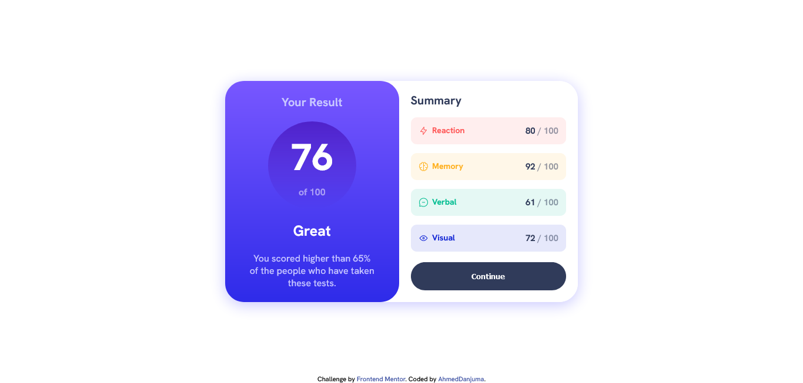
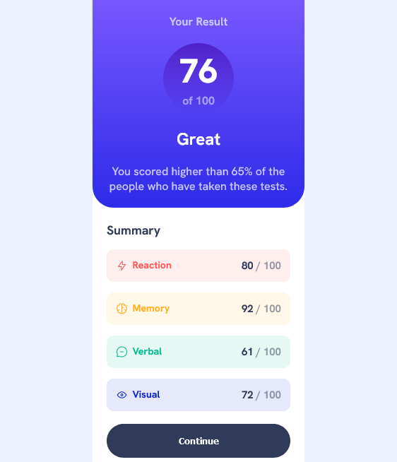

# Frontend Mentor - Results summary component solution

This is a solution to the [Results summary component challenge on Frontend Mentor](https://www.frontendmentor.io/challenges/results-summary-component-CE_K6s0maV). Frontend Mentor challenges help you improve your coding skills by building realistic projects. 

## Table of contents

- [Overview](#overview)
  - [The challenge](#the-challenge)
  - [Screenshot](#screenshot)
  - [Links](#links)
- [My process](#my-process)
  - [Built with](#built-with)
  - [What I learned](#what-i-learned)
- [Author](#author)

## Overview

### The challenge

Users should be able to:

- View the optimal layout for the interface depending on their device's screen size
- See hover and focus states for all interactive elements on the page
- **Bonus**: Use the local JSON data to dynamically populate the content

### Screenshot

### Links

- Solution URL: [Frontend Mentor](https://www.frontendmentor.io/solutions/result-summary-component-using-sass-flexbox-and-responsive-design-UgigxbPy0x)
- Live Site URL: [Github](https://ahmeddanjuma.github.io/result-summary-card-component/)

## My process

### Built with

- Semantic HTML5 markup
- CSS custom properties
- Flexbox
- Mobile-first workflow
- SASS

### What I learned
- I learnt how to use BEM naming convention for naming classes
- Learnt SASS. mixins, include, nesting in css, import, how to set variables
- Linear gradient background
- Relative lengths [em, rem]
- Flex direction css property

## Author

<!-- - Website - [Add your name here](https://www.your-site.com) -->
- Frontend Mentor - [@AhmedDanjuma](https://www.frontendmentor.io/profile/AhmedDanjuma)
<!-- - Twitter - [@yourusername](https://www.twitter.com/yourusername) -->

# result-summary-card-component
